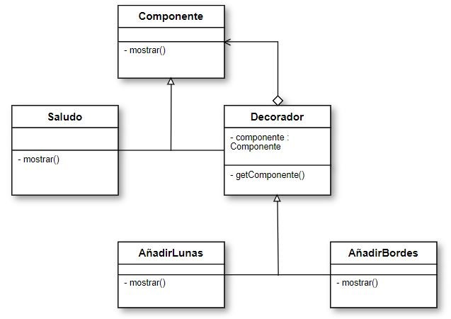

# Patron Decorator

**Este es un ejemplo de la estructura de el patron Decorator trabajado en la Universidad EAFIT 2018-2**

# Problematica
El patrón Decorator responde a la necesidad de añadir dinámicamente funcionalidad a un Objeto. Esto nos permite no tener que crear sucesivas clases que hereden de la primera incorporando la nueva funcionalidad, sino otras que la implementan y se asocian a la primera.

# Modelo de clases de la solucion implementada


# Lenguaje de programacion
**JAVA**

# Ejecucion
**Este codigo solo muestra la esructura del patron, por lo cual solo ha sido diseñado con motivos de entender este patron**
- Este codigo fue realizado en netbeans
```bash
# Clona este repositorio
git clone https://github.com/jcamilomnavia/Decorator-ST0250-2018-2
# Ve al directorio del repositorio
cd Decorator-ST0250-2018-2
# Abrir con visual studio code
code .
```
# Autores
- Juan Camilo Marin Navia
- Federico Agudelo Mejia
- Stefania Zapata Osorio
